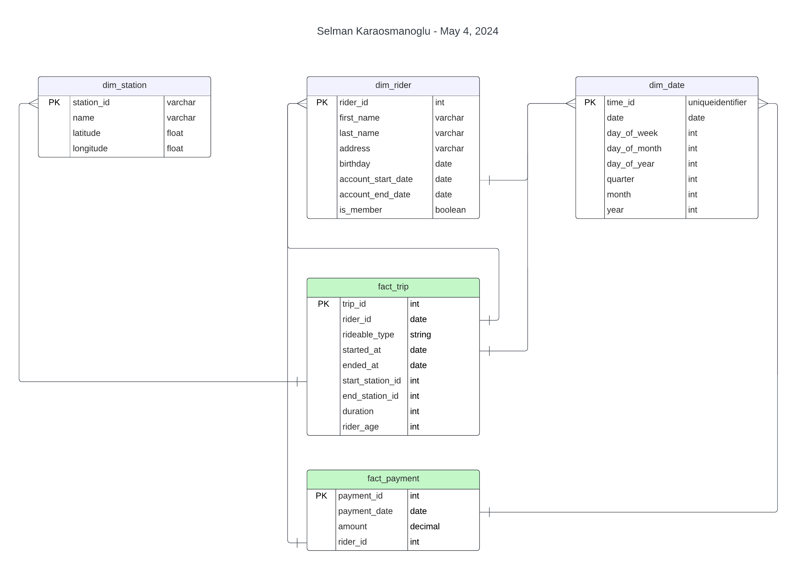

By Selman Karaosmanoglu

## Date created
04 May 2024

# Building an Azure Data Warehouse for Data Analytics

## Overview

Azure Synapse Analytics Data Warehouse Solution

This project aims to create a robust data warehouse using Azure Synapse Analytics. Key steps include:

- Star Schema Design: Develop a star schema based on business outcomes.
- Data Import: Import data into Synapse.
- Transformation: Transform data into the star schema.
- Analytics Reports: Visualize insights using Synapse Analytics.
This dataset encompasses anonymized trip data from the Divvy bike sharing program in Chicago

## Star Schema

The business outcome: 

Analyze how much time is spent per ride
- Based on date and time factors such as day of week and time of day
- Based on which station is the starting and / or ending station
- Based on age of the rider at time of the ride
- Based on whether the rider is a member or a casual rider

Analyze how much money is spent
- Per month, quarter, year
- Per member, based on the age of the rider at account start

## Azure Blob Storage

## Requirements

Language: Python 3.9

Libraries: psycopg2

## Credits
Udacity Data Engineer Nanodegree Program